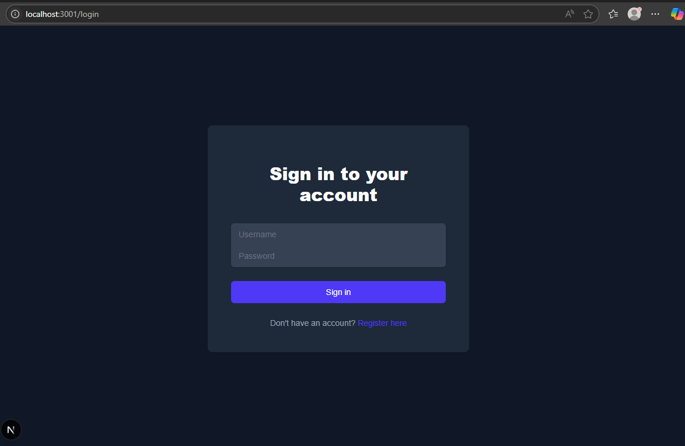
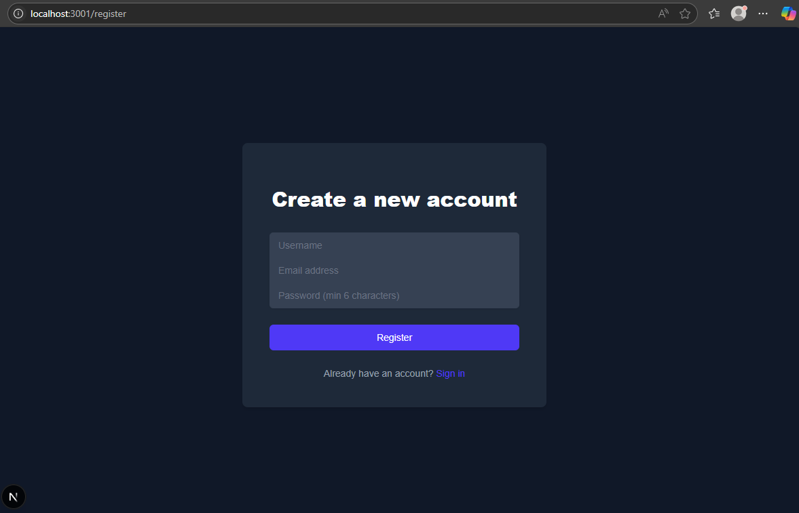
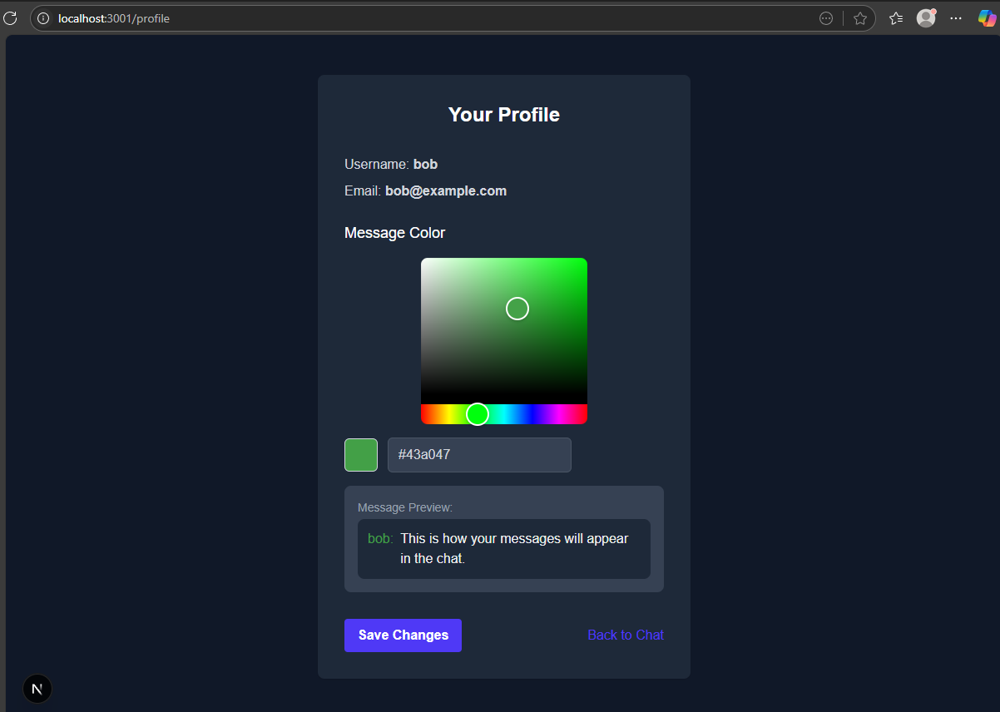
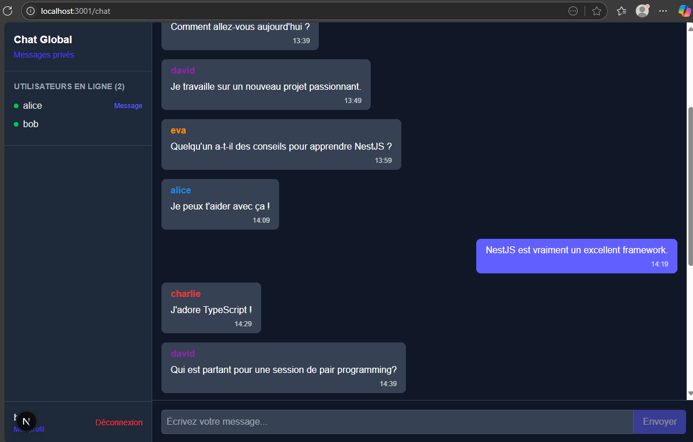
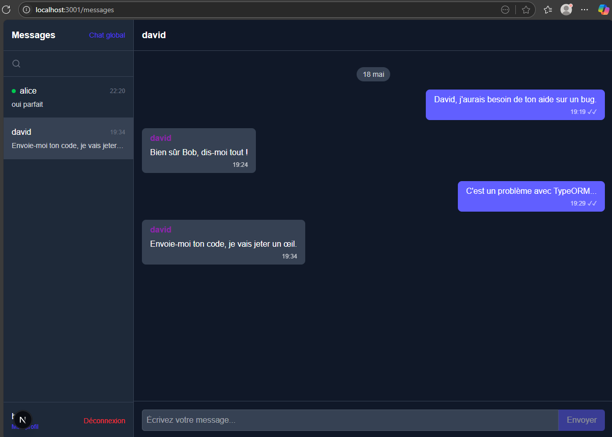

# Chat App (NestJS & Next.js) - Robin FAUCHERY 5IW3

## 🤝 Description

This is a chat application built with NestJS backend and Next.js frontend. The project provides real-time communication capabilities in a modern web application with socket.io integration for instant messaging.

## 📋 Table of Contents

- [Chat App (NestJS & Next.js)](#chat-app-nestjs--nextjs)
  - [🤝 Description](#-description)
  - [📋 Table of Contents](#-table-of-contents)
  - [🛠️ Tech Stack](#️-tech-stack)
  - [🚀 Prerequisites](#-prerequisites)
  - [⚙️ Installation & Initialization](#️-installation--initialization)
    - [Backend Setup](#backend-setup)
    - [Frontend Setup](#frontend-setup)
    - [Environment Variables](#environment-variables)
  - [🔥 Usage](#-usage)
    - [Running the Backend](#running-the-backend)
    - [Running the Frontend](#running-the-frontend)
  - [✨ Features](#-features)

## 🛠️ Tech Stack

- **Backend**
  - NestJS - A progressive Node.js framework
  - TypeScript
  - Socket.io - For real-time communication
  - JWT Authentication
- **Frontend**

  - Next.js - React framework
  - TypeScript
  - Socket.io-client
  - js-cookie - For cookie management

- **Database**

  - PostgreSQL

- **Tools & DevOps**
  - npm/yarn - Package management
  - Docker
  - Git - Version control

## 🚀 Prerequisites

Before getting started, ensure you have the following installed on your machine:

- Node.js (v16 or higher)
- npm or yarn
- Git
- Docker

## ⚙️ Installation & Initialization

Clone the repository:

```bash
git clone https://github.com/Robiinf/chat-app-nestjs-esgi.git
cd chat-app-nestjs-esgi
```

### Backend Setup

```bash
# Navigate to the backend directory
cd backend

# Install dependencies
npm install
```

### Frontend Setup

```bash
# Navigate to the frontend directory
cd frontend

# Install dependencies
npm install
```

### Environment Variables

1. Create a `.env` file in the backend directory with the following variables:

```
DB_HOST=localhost
DB_PORT=5432
DB_USERNAME=chatuser
DB_PASSWORD=chatpass
DB_NAME=chatdb

JWT_SECRET=mysecretkey
```

2. Create a `.env.local` file in the frontend directory:

```
NEXT_PUBLIC_API_URL=http://localhost:3000
```

## 🔥 Usage

### Running the Backend

```bash
# Start the PostgreSQL database using Docker
cd docker
docker-compose up -d

# Navigate back to the backend directory
cd ../backend
# Run database seeds
npm run seed
# Run in Development mode
npm run start:dev
```

### Running the Frontend

```bash
# Navigate to the frontend directory
cd ../frontend
# Run in Development mode
npm run dev
```

## ✨ Features

- User registration and login

- User authentication with JWT
- User profile management (update color profile)
- Real-time global messaging with Socket.io
- Private messaging between users
- User search functionality
- User presence indication (online/offline status)
- Message history
- Handling typing indicators and read messages
- (Adminer running on port 8080) You can access it at `http://localhost:8080` after starting the Docker container with the credentials in the `.env` file.

### How to Use

- Open two different browser tabs or windows on `http://localhost:3001`.
- Register or log in with a user in one tab and log in with other credentials in the other tab. For testing, you can use the following credentials:
  - username: `bob` - password: `password123`
  - username: `alice` - password: `password123`
- You can send messages in the global chat (`/chat`) or private chat (`/messages`).
- You can also update your profile color by clicking on the profile link in the bottom left corner (`/profile`).
- The application will show the online status of users in the global chat and private chat.
- You can search for users in the global chat and send them private messages.
- The application will show typing indicators when users are typing in the direct messages.
- The application will show read messages when users have read the direct messages in the chat.
- The application will show the global message history or private ones when you open a private chat with a user.

### Screenshots






